# Gestão de clientes GFT
Sistema de gestão de clientes desenvolvido para um desafio de DEV-backend júnior

## Funcionalidades
- Cadastro de cliente 
- Consulta de cliente
- Buscar por ID
- Buscar por CPF
- Buscar por nome
- Atualização de cliente
- Exclusão de cliente
- Paginação
- Ordenação
- Validações com Bean Validation
- Tratamento global de exceções 
- Documentação Swagger/OpenAPI
- Testes unitários
- Testes de integração

## Tecnologias utilizadas
- Java 21
- Spring Boot 3+
- Spring Web
- Spring Data JPA
- Spring Validation
- Lombok
- Maven
- Banco de dados PostgreSQL
- Flyway 
- Swagger / OpenAPI
- Tratamento global de exceções

## Como executar 
### Primeiros passos:
Clone o repositório e abra a pasta "GFT" em uma IDE ou editor de código de sua preferência

Para executar o projeto é necessário ter:
- Java 21
- PostgreSQL
- Maven

Depois execute normalmente a aplicação. Usando:
````
GftApplication.java
````

### Estrutura do projeto:
O projeto foi organizado em camadas para facilitar a navegação pelo código.

```` 
GFT/src/main/java
 - config
 - controller
 - dto
 - entity
 - exception
 - mapper
 - repository
 - service
````
### Banco de Dados e Migration
Utilizei o Flyway. As definições das tabelas podem ser encontradas em:
`````
src/main/resources/db/migration
`````

### Principais Endpoints
- POST/clientes --> Cadastrar cliente
- GET/clientes --> Listar todos os clientes 
- GET/clientes/{id} --> Buscar por ID
- GET/clientes --> Buscar por nome ou cpf
- PUT/clientes/{id} --> Atualizar cliente
- DELETE/clientes/{id} --> Remover cliente 

### Regras de negócio:
- CPF é único
-  E-mail é único
-  Nome é obrigatório
-  CPF é obrigatório
- E-mail é obrigatório
-  Não é permitido cadastro com campos inválidos
- E-mail só pode no formato de email
-  CPF só com números e com 11 digítos


### Documentação da API 
Após iniciar a aplicação no:
```` 
GftApplication.java
````
O Swagger estara disponível na seguinte URL:
```` 
http://localhost:8080/swagger-ui.html
````` 
### Demonstração
#### **Tela de início do Swagger:** 
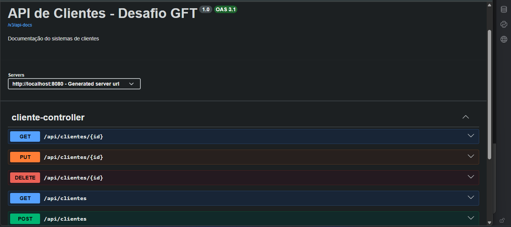
#### **Adicionar clientes(POST):**
Vá na parte de POST e clique em "Try it out" e preencha os campos corretamente

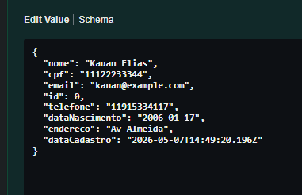
Depois clique em 'Execute' e o cliente será criado

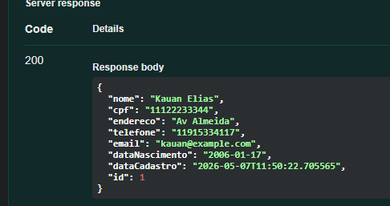
#### **Listar Clientes(GET):**
Vá na parte de GET/clientes e clique em "Try it out", depois "Execute" que já ira aparecer uma lista de clientes

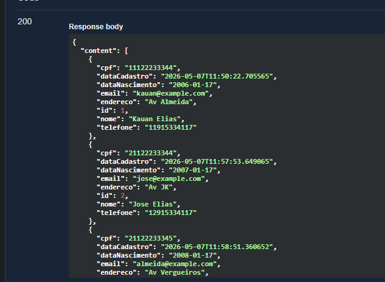

- ##### Buscar por nome: note que também tem a parte de buscar cliente por nome, bastar digitar o nome do cliente que queira procurar
- ##### Buscar por cpf: mesma coisa do buscar nome mas dessa vez só colocar o cpf do cliente
- ##### Page: e também tem o page onde é só selecionar a página que deseja, o tamanho e caso queira no 'sort' é possível ordenar pela string que desejar(exemplo: nome,ASC ou endereco,ASC)

#### **Buscar por ID(GET{id):**
Selecione um ID que deseja e depois clique em "Try it out"

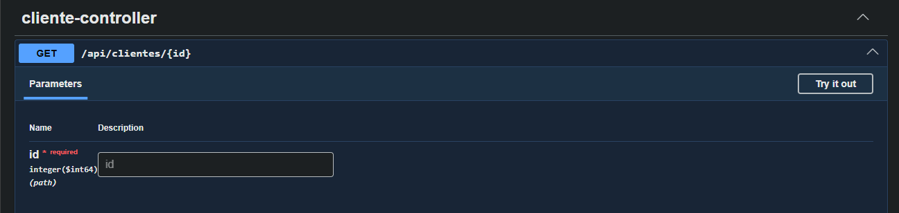

E com isso ira aparecer o cliente com o Id selecionado

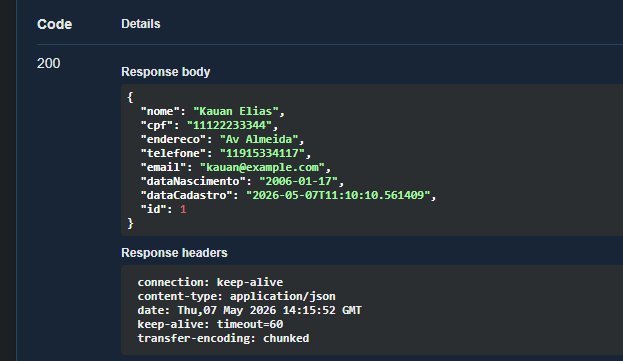
#### Atualizar cliente(PUT):
Selecione o Id do cliente que deseja atualizar e atualize o que desejar no body

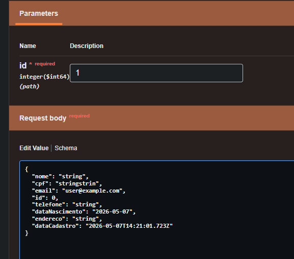
Após a mudança, só buscar o mesmo id(atualizei o endereço):

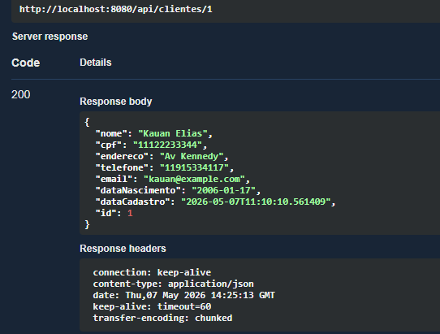
Nessa parte também existem duas regras, não pode mudar o cpf

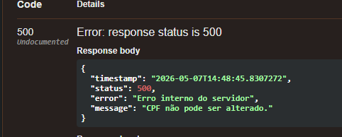

e não pode colocar um e-mail já em uso

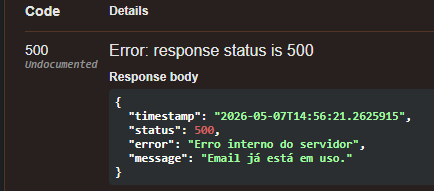
#### **Deletar cliente(DELETE):**
Digite o Id que deseja deletar e ele não aparecera mais na lista por exemplo(deletei o id=3)

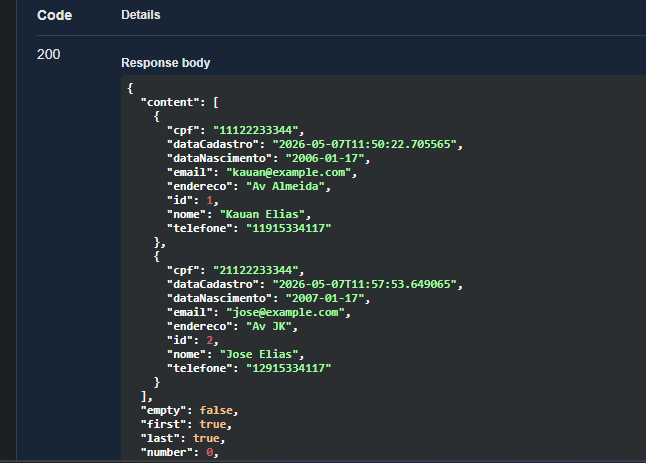
#### **Erros de validação:**
- Cpf único:
  
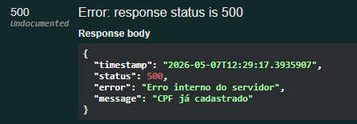
- E-mail único:
  
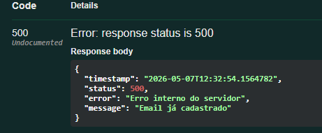
- Nome obrigatório:
  
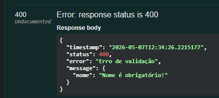
- Cpf obrigatório:
  
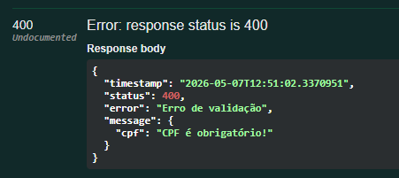
- E-mail obrigatório:
  
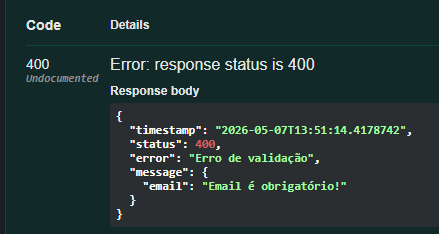
- Validar formato de e-mail:
  
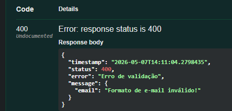
- Validar CPF com tamanho certo:
  
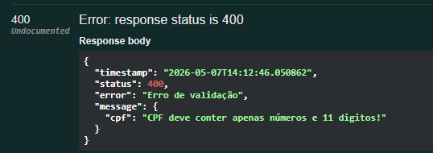

#### **Tratamento de erro**
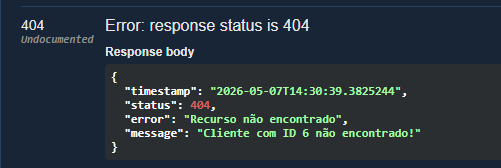
